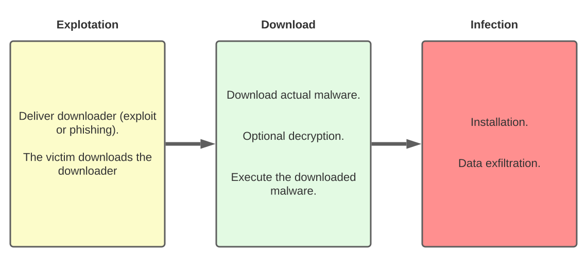

# RAT_Rust

**Disclaimer:**

Rust Remote Access Tool with worm capabilities, this Remote Access Tool
it's just a personal project with no other intentions than seek for knowledge, 
it can be used for simple remote access with legitimate porpoises
or to make Trojan access.

## Description:
Remote Access Tool with multi-platform, multi-architecture capabilities for easy 
spreading/replication, also uses long-polling HTTPS as protocol for communication and implements
temporary keys for data exfiltration encryption.

## Why Rust?

Almost all existing RAT are developed in C or C++ for the agent due to the low resources usage
and the low-level control these languages provide, and Python, PHP, Ruby or Go for the server 
and client parts, these languages are not safe, and it’s not uncommon to find vulnerabilities
in various RATs. Also, it requires developers to know multiple programming languages, which is
not that easy as all languages have they own pitfalls, toolchains, and hidden surprises.
Finally, This mix of languages don’t encourage code re-use, and often, these RAT provide plugins
and addons to add features as standalone binaries, which are easier to detect by monitoring
systems.

On the other hand, Rust provides low-level control, but also easy package management, high-level
abstractions and great code re-usability. Not only Rust allow us to re-use code across the 
agent, the server and the client, but also by re-using all the packages we have in reserves, 
such as the scanners and exploits we previously crafted.

